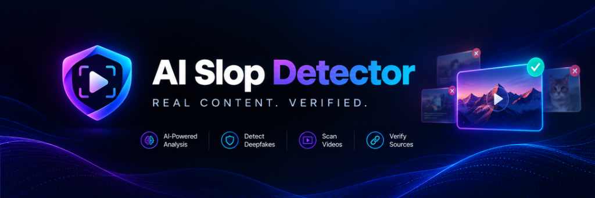
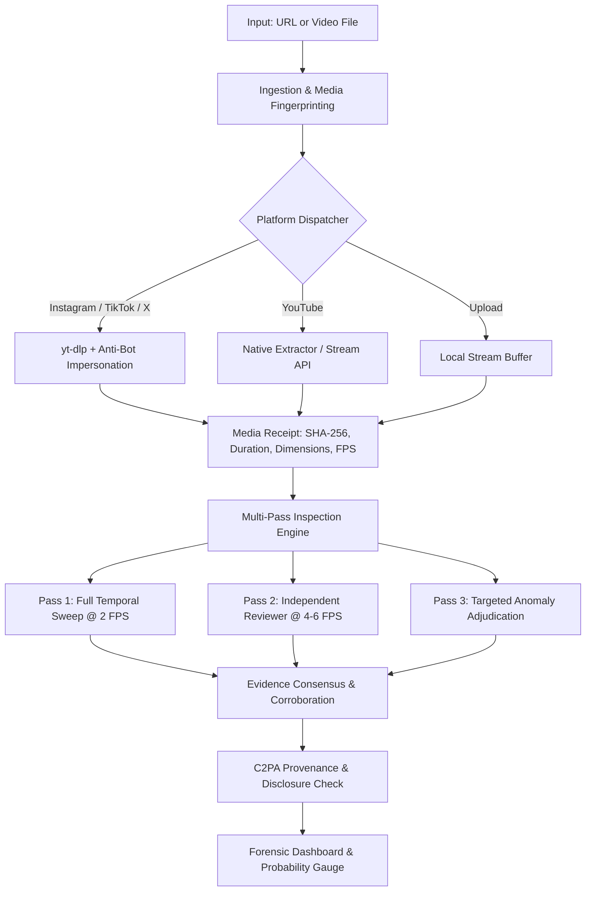

<div align="center">



# AI Slop Detector Pro
### *REAL CONTENT. VERIFIED.*

**Agentic Deepfake & AI Video Intelligence Forensic Detector**

[](https://nextjs.org/)
[](https://www.typescriptlang.org/)
[](https://ai.google.dev/)
[](https://vitest.dev/)
[](https://www.docker.com/)
[](LICENSE)

</div>

---

## 🔍 Overview

**AI Slop Detector Pro** is an advanced, evidence-based multimodal video forensic suite designed to unmask generative AI videos, diffusion model artifacts (Sora, Runway, Kling, Hailuo, Pika, Veo), and concept deepfakes. 

It inspects videos from **YouTube, TikTok, Instagram, X (Twitter)**, or direct file uploads, running multi-pass timeline sweeps, spectral audio cadence checks, and identity integrity scans to produce a calibrated forensic report. this is one of the best Repo of in the industry.

---

## ✨ Key Features

- **🎯 Dual-Metric Probability Gauge**:
  - Prominently displays **AI Likelihood %** vs. **Authentic / Camera %** with neon cyber telemetry and dual-split distribution bar.
  - Transparent indeterminate state for conflicting evidence.
- **⚡ Multi-Stage Animated Forensic Telemetry**:
  - Live progress tracking across 4 phases: *Transport & Ingestion* → *Temporal Sweep* → *Artifact Forensics* → *Evidence Synthesis*.
- **📊 Executive KPI Dashboard**:
  - **Visual Forensics**: Diffusion noise, unnatural lighting, temporal jitter, warping.
  - **Audio & Cadence**: Voice synthesis flags, cadence anomalies, or silent track detection.
  - **Identity Integrity**: Face-swap boundary detection, lip-sync manipulation.
  - **Inspection Coverage**: Independent pass counts, agreement metrics, and consensus validation.
- **⏱️ Timestamped Anomaly Moments**:
  - Flagged moments with severity badges (`High`, `Medium`, `Low`) and direct jump links to timestamps.
- **🛡️ C2PA Content Credentials & Provenance**:
  - Cryptographic verification of digital source metadata and hardware provenance.
- **🌐 Universal Platform Ingestion**:
  - Full support for **Instagram Reels**, **TikTok Videos**, **YouTube Shorts/Videos**, **X (Twitter) Clips**, and **Direct File Uploads** (MP4, MOV, WebM, AVI up to 500 MB).
- **💾 Privacy & Exportable Reports**:
  - Download signed, verifiable JSON forensic reports with local browser annotations.

---

## 🛠️ Architecture



---

## 🚀 Quick Start

### Prerequisites
- **Node.js**: `v22.22` or newer
- **pnpm**: `11.19.0` (recommended)
- **Python**: `3.10+` with `pip`
- **FFmpeg & ffprobe**: Installed and available in your `PATH`

### 1. Clone & Install
```bash
git clone https://github.com/libragik/AI-Slop-Detector-Pro.git
cd AI-Slop-Detector-Pro
pnpm install
```

### 2. Configure Environment Variables
Copy the template and add your API keys:
```bash
cp .env.example .env.local
```

Edit `.env.local`:
```env
# Required: Google Gemini API Key
GEMINI_API_KEY=your_gemini_api_key_here
GEMINI_MODEL=gemini-3.7-flash
GEMINI_REVIEW_MODEL=gemini-3.7-flash
GEMINI_VIDEO_PROCESSING=static

# Media Downloader & Limits
YT_DLP_PATH=yt-dlp
FFPROBE_PATH=ffprobe
MAX_MEDIA_BYTES=500000000
MAX_DURATION_SECONDS=300

# Optional: Secondary Specialist & Database Cache
SIGHTENGINE_ENABLED=false
CACHE_ENABLED=false
```

### 3. Run Development Server
```bash
pnpm dev
```
Open [http://localhost:3000](http://localhost:3000) in your browser.

---

## 🐳 Docker Deployment

The repository includes an optimized multi-stage `Dockerfile` with Node.js 22, Python 3, FFmpeg, and pinned `yt-dlp`:

```bash
# Build the Docker container
docker build -t ai-slop-detector-pro .

# Run with your local environment configuration
docker run -d --rm -p 3000:3000 --env-file .env.local ai-slop-detector-pro
```

Access the app at `http://localhost:3000`.

---

## 🧪 Testing & Validation

The project includes an exhaustive suite of 404 unit, integration, and security tests:

```bash
# Run all automated tests
pnpm test

# Run UI and detector state tests specifically
pnpm vitest run tests/ui-response.test.ts tests/detector-state.test.ts

# Production build check
pnpm build
```

---

## ⚖️ Ethical & Technical Limitations

- This tool provides an **evidence-based assessment**, not legal proof of authorship.
- False alarms and misses can happen on heavily compressed footage, stylized CGI, or rapid motion blurs.
- Missing Content Credentials are treated as neutral evidence.

---

## 📄 License

This project is licensed under the [MIT License](LICENSE).
