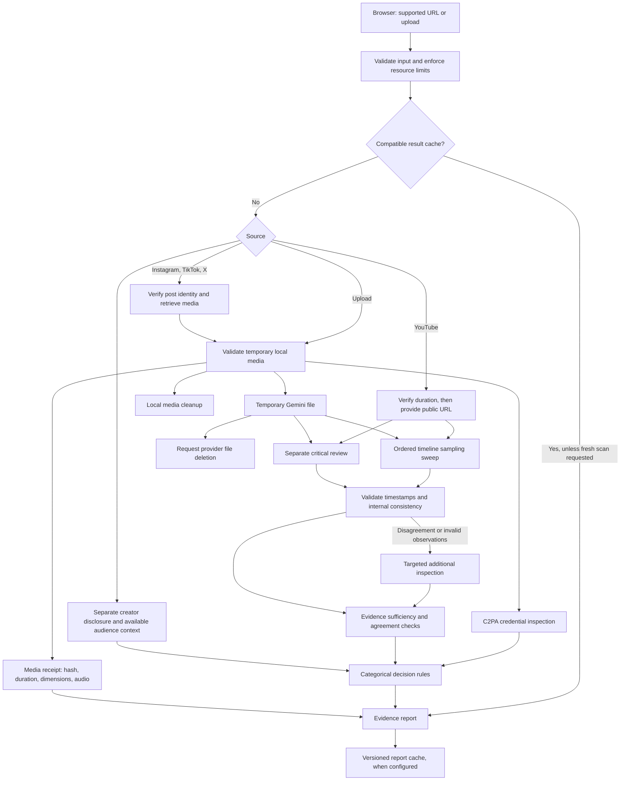

# AI Slop Detector product plan

Updated 2026-09-04. This describes the implemented evidence-reporting design and the work still needed to establish detection performance. Implementation and transport checks do not establish accuracy.

## Product promise

**Paste a short video or upload a clip to inspect possible AI generation, see the observations behind the assessment, and understand what remains uncertain.**

The initial audience is someone deciding whether to forward a suspicious YouTube Short, TikTok, Instagram Reel, or X video post. The report should make that decision more informed without authenticating a video's origin. Fresh scans can take several minutes; available compatible cached reports can be returned sooner.

The interface presents five distinct outcomes:

| Outcome | Meaning |
| --- | --- |
| AI indicators detected | The analysis found supported observations of possible generation or material AI alteration. This is not verified authorship. |
| No clear AI indicators | Sufficient, consistent inspection did not identify convincing indicators. This does not establish that the video came from a camera. |
| Inconclusive | Coverage, evidence, or agreement is insufficient for a supported decision. |
| AI use disclosed | A creator or platform disclosure states AI use. Disclosure remains separate from forensic verification. |
| Verified AI provenance | Valid, trusted Content Credentials contain an explicit generative-media assertion in the active manifest. The credential establishes the assertion it carries, not every claim about the scene. |

There is no consumer AI-probability percentage or model-derived “high confidence” label. Model evidence scores are uncalibrated diagnostics. A model's failure to find artifacts cannot authenticate modern generated video.

## Implemented architecture

The first pass requests ordered static sampling across the supplied duration. A separately prompted review checks potential anomalies and ordinary explanations. Disagreement or invalid evidence can trigger a third inspection with finer sampling of relevant windows. Models and processing settings come from configuration and form part of the detector fingerprint; their selection still needs measured comparison.

Each pass retains its requested sampling, completion status, raw assessment, validation findings, and available usage information. A completed provider response does not prove that every original frame was inspected. Separate prompts to the same model can share systematic mistakes; agreement is a decision prerequisite, not independent proof of origin.

Local uploads and retrieved social media produce a file receipt. Direct YouTube URL analysis has no exact downloaded-file fingerprint or local C2PA inspection. Retrieval failures present an upload fallback. Source identity, duration, file size, concurrency, and request limits are enforced before or around expensive work.

## Detection contract

Visual generation or editing, synthetic audio, and identity manipulation are assessed separately. The video analysis must cite bounded timestamped observations, consider evidence against generation, and distinguish conventional CGI/VFX, animation, filters, compression, interpolation, staging, and unusual real events from AI evidence. Captions, filenames, OCR, and other media content are untrusted data and cannot instruct the detector.

Decision rules now operate on categorical findings and evidence quality:

- Require consistent classifications, modality findings, timestamps, and evidence-strength values. Contradictions cannot become a reassuring negative through a low numeric score.
- Use an inconclusive outcome when inspection is incomplete, observations are invalid, quality degrades the assessment, or disagreement remains unresolved.
- Require adequate coverage and valid corroborating review before returning “No clear AI indicators.” A clean result still does not authenticate the source.
- Keep creator/platform disclosure and verified C2PA provenance as distinct outcomes. Missing credentials or missing disclosures are neutral.
- Keep audience comments as context. They never add to or subtract from the detector's evidence score.
- Show the reasons for the outcome, visible limitations, and whether further review is required.

The old probability dial, arbitrary score floors for disclosures, comment adjustments, and binary score threshold are retired. Internal base and final evidence values remain available in technical diagnostics and evaluation outputs; they are not calibrated probabilities.

Reports expose source receipts and sampling details, support a fresh scan, and can be downloaded as JSON. Optional feedback is saved only in the user's browser and included in the export as an unverified user annotation. It does not change the result, train the model, or create ground-truth labels automatically.

## Validation and delivery work

### Current implementation validation

Decision, consistency, schema, media-boundary, cache, and UI tests cover reproduced failure mechanisms. Live browser checks exercise a real Instagram retrieval and report, a fresh rescan, source receipts, local notes, exports, and a narrow mobile layout. These checks establish software behavior. The dated record in [VERIFICATION.md](VERIFICATION.md) separates current work from the legacy transport smoke tests.

Final integrated verification remains a release gate. Re-run the complete automated suite, typecheck, lint, build, and current deployment checks after concurrent implementation work settles. Validate each supported platform and upload path against the final build, including failure and cleanup paths. Optional cache and YouTube context configuration must be verified before advertising those channels as available.

### Detection evaluation before accuracy claims

The evaluation harness records predictions against versioned manifests, including abstentions, errors, model/policy settings, and available cost and latency data. Dataset development runs help identify failure modes; they are not held-out evidence. See [the evaluation guide](../eval/README.md) for commands and interpretation.

Required work before claiming reliable detection:

- Recover the exact user-reported false negative and preserve its media identity and original report when available.
- Establish documented source labels and source-independent development and held-out splits. Dataset-author labels should be distinguished from independently verified camera provenance.
- Cover multiple current generators, real-camera footage, conventional CGI/VFX, screen recordings, text overlays, fast inserts, synthetic audio, identity changes, mixed clips, and social-platform recompression/reposts.
- Compare model and sampling configurations using the same development set. Record latency, cost, false positives, missed AI, abstentions, and unsupported negative outcomes by category.
- Freeze the candidate configuration before using the held-out set. Count abstentions against end-to-end AI recall and report operational errors separately, so abstention cannot hide detection failures.
- Publish sample counts, label limitations, confidence intervals where appropriate, weak categories, and the tested version. Maintain a regression corpus without claiming it remains held out after tuning.

The current task does not establish completed held-out validation or calibrated accuracy. Any future probability display would require a separate calibration study and validation under the intended deployment distribution.

### Controlled public launch

- Replace process-local admission control with a shared quota store and bounded daily spend.
- Add a suitable anonymous allowance or abuse control before fresh paid scans.
- Move fresh scans to persisted background jobs with restart recovery and explicit progress.
- Monitor provider cost, latency, errors, cache compatibility, and retrieval failures.
- Review social-platform retrieval reliability and keep upload available as a core path.
- Document retention and deletion behavior, including provider cleanup failures, and provide an abuse/deletion contact.
- Verify the final production environment and mobile behavior on current iOS and Android browsers.

Public-launch readiness requires both operational controls and evidence supporting the claims made in the product. A passing build or a successful API request is insufficient.

### Later work, subject to measured benefit

- Compare specialized video/audio forensic providers using the same benchmark and measure whether their errors differ from the current model's.
- Add human review and disputes without treating audience votes as proof.
- Evaluate perceptual fingerprints for cross-platform repost detection; the implemented SHA-256 receipt identifies exact bytes only.
- Consider an API once report semantics, versioning, quotas, and reliability are stable.
- Evaluate additional watermark/provenance services if an appropriate supported developer interface becomes available.

## Known limits

- Plausible generated footage can contain no visible artifacts the model recognizes. Agreement between reviews does not eliminate this failure mode.
- Requested sampling can miss brief events. Provider traces describe processing activity and do not certify exhaustive frame coverage.
- Most social copies lack useful provenance metadata. An absent credential is not evidence of authenticity or generation.
- Public-link availability, extraction, authentication requirements, and platform recompression can change. Upload fallback cannot recover unavailable original source information.
- YouTube context requires its optional API configuration; social captions depend on retrieval, and general social comments are not a complete evidence channel.
- Direct YouTube analysis and file-based analysis have different receipt and provenance coverage. Reports must disclose that difference.
- Temporary local media is cleaned up and provider-file deletion is requested after analysis. A cleanup failure can leave the provider copy until deletion or expiry; do not promise instantaneous removal.
- Synchronous processing, process-local limits, and optional caching remain operational constraints until the public-launch work is completed.

Official technical references: [Gemini video understanding](https://ai.google.dev/gemini-api/docs/video-understanding), [Gemini structured output](https://ai.google.dev/gemini-api/docs/structured-output), [Gemini API key security](https://ai.google.dev/gemini-api/docs/api-key), and [C2PA JavaScript SDK](https://opensource.contentauthenticity.org/docs/c2pa-js/).
